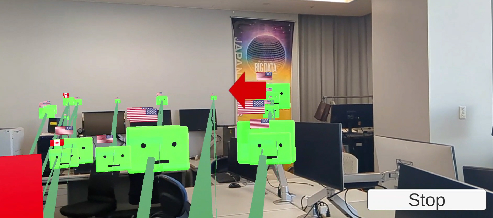

# NetTrafficARVisualizer
ネットワークの通信をARで可視化するシステム

あなたのスマートフォンで起こっている通信をARで可視化します。

# Requirement

- Unity：2021.3.21f1
- AR Foundation

## OPEN SOURCE LICENSES
- [android-vpnservice-example](https://github.com/mightofcode/android-vpnservice-example) APL 2.0
